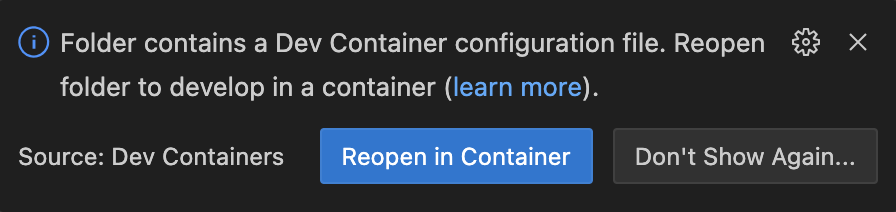
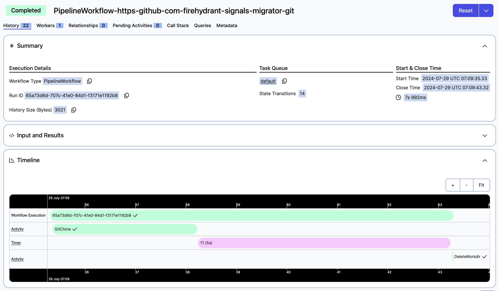
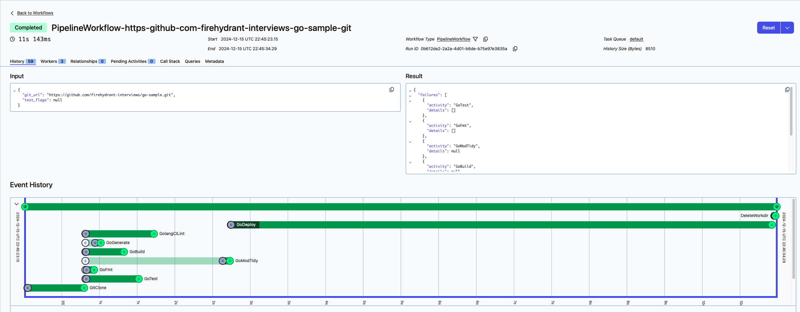
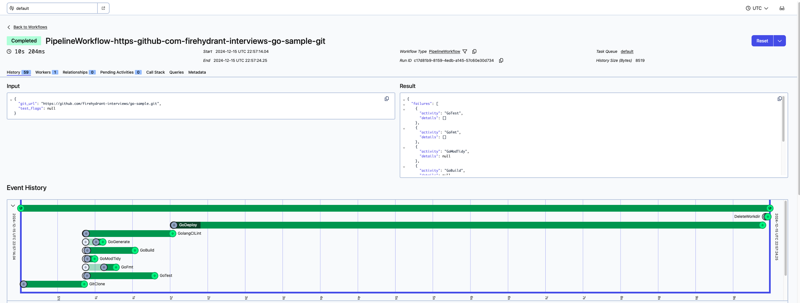
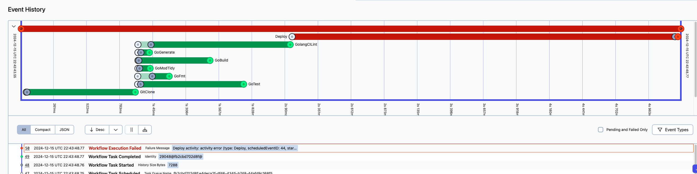
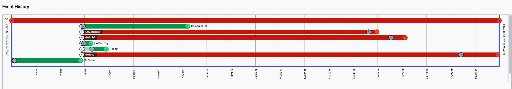
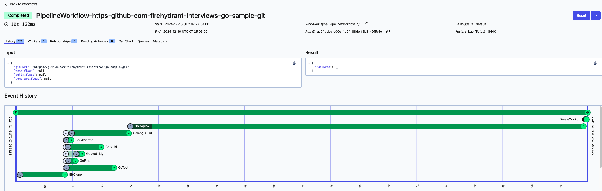
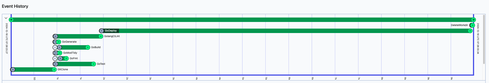

## What are we building?
This is essentially a simplified version of the Golang-based temporal production workflow. 

**TL;DR** 

Get creative and build `PipelineWorkflow` in [pipeline/pipeline.go](./pipeline/pipeline.go) as if it's a replacement for continuous integration.

We are building a continuous integration pipeline using Temporal. Imagine if something like GitHub Actions are written in Go, instead of YAML.

If you'd like to see an overview of Temporal, check out [PRIMER.md](./PRIMER.md). [Temporal documentation](https://docs.temporal.io) is also a great resource.

## What is the success criteria?

- Running `go run . worker` and `go run . pipeline` still works, just like it does in the boilerplate project.
- Given a YAML file as input for `PipelineParams` in [_examples/simple.yaml](./_examples/simple.yaml), the program should be able to start a pipeline.
- The pipeline should exercise fan-out and fan-in concurrency patterns (e.g. tests don't necessarily depend on linters to finish and vice versa, but deploy should wait on both).
- Try to break workflow determinism and fix it.
- Write tests on what you think is worth testing. Remember to consider the failure modes within the workflow (e.g. if a step fails, what should happen to the rest?).
- And finally, write about your work! We like to see thoughtful work, so please elaborate your reasoning and trade-offs.

We have provided [a sample Go repository](https://github.com/afanwang/go-sample) to use where you can easily inject failures to test various scenarios. Feel free to keep using it, fork and add more tags, or use other projects as the target for `git_url` in `WORKFLOW_INPUT` parameter.

## Getting started

We have set up this project to be nearly as launch-ready as we can think of by using [development containers](https://containers.dev) (see [.devcontainer](./.devcontainer)). This means you can use Visual Studio Code, or any editor that supports development containers to develop on this project. Initial build may take some time, but typically should be ready within 5 minutes.

</img>

In it, you will find the development environment to run this code and Temporal development server to manage the workflows. Additionally, a HTTPBin instance as a target to simulate any HTTP server if needed, but don't worry about it if you don't find any use for it! We just don't want you to waste time on setting up authentication / test account / etc.

> [!NOTE]
> Remember to use shell within Visual Studio Code, instead of your regular shell, as we need the commands to be run _inside_ the development container!

### Running boilerplate code

On one terminal session, start a worker with:

```sh
go run . worker
```

Then open another terminal session and queue a workflow execution with:

```sh
WORKFLOW_INPUT=_examples/simple.yaml go run . pipeline
```

With a properly running development setup, you should be able to see the Temporal Web UI at [http://localhost:6434](http://localhost:6434). Find the newly executed workflow in there and it should look like the following:



If all of the above works, you are now ready to develop!


# Summary
What did you learn in this exercise?

- Temporal workflow development. In particular:
    1. I learned how to implement a complex workflow using Temporal, incorporating parallel execution of activities while maintaining deterministic behavior.
	2. I gained experience in structuring a CI/CD pipeline as a workflow, handling various Go-related tasks such as testing, formatting, and building.
	3. I learned about the importance of error handling and result collection in a distributed workflow environment.
	4. I discovered how to use Temporal's `workflow.Selector` and `workflow.Future` to manage concurrent activities effectively.
 
Your experience on breaking workflow determinism and thoughts around it, i.e. if you were to explain what you learned to someone else, what would you say?

`workflow/deterministic_wrapper.go` is a good place to read.
- Workflow determinism is crucial in Temporal for ensuring consistent and predictable execution, especially when workflows need to be replayed or continued after interruptions.
- Breaking determinism can lead to inconsistent results and make debugging extremely challenging. 	 
- To maintain determinism while allowing parallel execution, it's important to:
	1. Always execute activities in the same order, even if they run concurrently.
	2. Use Temporal's built-in concurrency primitives like workflow.NewSelector() instead of Go's native concurrency features.
	3. Avoid relying on external state that might change between workflow executions.

Any trade-offs you made in completing this project?
- Parallelism vs. Simplicity: By running activities in parallel, we gained performance but increased code complexity.
- Error Handling Granularity: We chose to collect all errors rather than failing fast on the first error, which provides more comprehensive feedback but might increase execution time for workflows with early failures.
- Flexibility vs. Determinism: We prioritized deterministic behavior, which might limit flexibility in some scenarios where dynamic task ordering could be beneficial.
- Resource Usage: Running all checks in parallel might consume more resources at once, which could be a concern in resource-constrained environments.
- Complexity in Result Processing: The parallel execution required more complex result processing logic, which might make the code harder to maintain or extend in the future.


Remember that we like to see thoughtful work, so elaborating your thought process helps us understand your workstyle even better.
1. First of all, seems like the temporal image url is not correct. I got an error when I do `docker pull` of this url, see in the code snippet below. I changed it to the temporal official image from dockerhub `temporalio/admin-tools:latest`, and now I was able to bring up the dev container and see temporal UI running on localhost:6434.
```
❯ docker pull cgr.dev/chainguard/temporal-admin-tools:latest
Error response from daemon: unknown: {"errors":[{"code":"MANIFEST_UNKNOWN","message":"Unknown manifest"}]}
```

2. I do know github action pretty well, but I have not heard of temporal before this exercise. These are the list of items I need to figure out first:
- When I am on the temporal dashboard, how does temporal interact with `runpipeline.go`? Now I am able to see the beautiful workflow with all the events happened for the workflow.
- Looking into the go-sample repo, seems like the code of this repo is not what I need to focus on. It is just a sample repo the Temporal workflow will use, image it is one of our PR branch that the github action will perform on.

- From the execution log, I learnt that these steps were performed on the above repo:
    - gitclone
    - goTest
    - goFmt
    - deleteWorkDir
    - etc...
So, the workflow start will first schedule the workflow task queue, then list of work flow tasks will be started. I counted that there are 5  `Workflow Task Scheduled` -> `Workflow Task Started` -> `Workflow task completed`, each task may do one or more activities, for example, second task include both `goTest` and `goFmt`.
There is also number of attempts, and at the end of the workflow the workflow execution results is aggregated somehow from each task result.

3. Now, dive into the code or yaml (if there is any) to see where are these activities are defined. Here are the code snippet I found:
```
	worker.RegisterWorkflow(pipeline.PipelineWorkflow)

	pa := pipeline.PipelineActivity{}
	worker.RegisterActivity(pa.GitClone)
	worker.RegisterActivity(pa.GoTest)
	worker.RegisterActivity(pa.GoFmt)
	worker.RegisterActivity(pa.DeleteWorkdir)
```
From the Event History, I can see the `GitClone` happened, then `GoFmt` and `GoTest` were running at the same time, and when `GoTest`(whichever event took much longer time) finished, `DeleteWorkdir` were ran.

Where are the job order and parallelism defined? Above code snippet does not have such info.

4. So far I saw our four functions were put in `worker.go:worker.RegisterActivity()`, I read run.go, worker.go, runpipeline.go, pipeline.go. Ok, I figured that in the `pipeline.go` when GoFmt and GoTest called `ExecuteActivity()`, we get result before running the next activity, and the Get() is a blocking call:

```
// Get blocks until the future is ready. When ready it either returns non nil error or assigns result value to
// the provided pointer. Example:
	var v string
	if err := f.Get(ctx, &v); err != nil {
	    return err
    }
```

5. Digging more. Now I have a rough idea of how the existing code and high-level temporal work. I would like to read a bit more of the temporal library code `go.temporal.io:workflow.go`, there are a lot relevant information in the code comments, I am also learning the temporal official documents like `https://github.com/temporalio/samples-go`. Quite some readings here...

6. Start working on the code. First, I will make a sequential execution of all possible jobs, make it working. Still trying to understand why `Go code, however, has the chance to not be deterministic. We need to make it deterministic.`. My understanding is Golang, like most programming languages, can be used to write both deterministic and non-deterministic code. The determinism depends on how the code is written, not on the language itself. In the context of workflow systems like Temporal, there are specific considerations for determinism:
- External dependencies: Go code that interacts with external systems (databases, APIs, etc.) can introduce non-determinism if not handled properly.
- Concurrency: Go's goroutines and channels, if not used carefully, can lead to race conditions and non-deterministic behavior.
Go itself doesn't inherently make code non-deterministic, the challenge lies in writing workflow code that remains deterministic across multiple executions and potential interruptions etc.

7. Ok, finally finished to make the GitClone() to run first, then everything else except the Godeploy() to run in parallel, and if these 7 steps passed, do GoDeploy(). Please see attached screenshots for results.
```
	worker.RegisterActivity(pa.GitClone)
	worker.RegisterActivity(pa.GoTest)
	worker.RegisterActivity(pa.GoFmt)
	worker.RegisterActivity(pa.GoGenerate)
	worker.RegisterActivity(pa.GoModTidy)
	worker.RegisterActivity(pa.GolangCILint)
	worker.RegisterActivity(pa.GoBuild)
	worker.RegisterActivity(pa.GoDeploy)
	worker.RegisterActivity(pa.DeleteWorkdir)
```

ScreenShot 1 for Deploy Succeed:


ScreenShot 2 for Deploy Succeed:


Screenshot 3 for Deploy Failed:


8. Ok, now I have got fan-in and fan-out working on temporal, the next will be make all the failed tags working as well. Hmm, I think the original code may have a bug because even when I run the `fail.yaml` on the main branch, I can see the `GoTest` has result of:
```
[
  {
    "Metadata": {
      "Workdir": "/tmp/PipelineWorkflow-https-github-com-afanwang-go-sample-git2030283255"
    },
    "FailedTests": [
      {
        "Action": "fail",
        "Package": "github.com/afanwang/go-sample",
        "Test": "TestFail",
        "Elapsed": 0
      }
    ]
  }
]
```
but the workflow is still Green. Ok, I also tried to make PipelineWorkflow() to return an error if result.Failures are not empty, still no luck even I am sure the error happened. Eventually, I figured there is a bug in the GoTest function.
```
	args := []string{"test", "./..."} // Should not do []string{"test", "-json"}
	args = append(args, params.Flags...)
```

I also changed the failtest.yaml to be
```
# This file conforms to pipeline.PipelineParams
git_url: "https://github.com/afanwang/go-sample.git"
test_flags: ["-tags", "failtest"]
build_flags: ["-tags", "failbuild"]
generate_flags: ["-tags", "failgenerate"]
```

Now I am able to see these three tasks are failing and will not deploy.


9. On to the last task, to make the deterministic workflow. During my research I found there is a `deterministic_wrapper.go` in go.temporal library, and the Selector is the way to make the tasks run in a deterministic while still run in parallel. After the change, I can see run 1 and run 2 has the same order. We can see these two runs are exactly the same.

Run 1:

Run 2:



10. Last, I need to write tests. Because the code I wrote so far were ran using Temporal dashboard. Is there a way to test the developed workflow pragmatically? I can see there are Json `Input` and `Result` from temporal dashboard. So it should be doable. Then, how about unit-test, test coverage, as well as integration tests and performance tests?

I have few years of experience working as a test automation engineer early in my career, and my most recent job is to developing software-defined-vehicle mission critical cloud software, so I treat testing a serious critical assurance for high-quality software. 

From Temporal official site I found an article dedicated to testing https://docs.temporal.io/develop/go/testing-suite, it answered my question pretty well, so I will just follow it.

Added a pipeline_test.go to test the behavior of the workflow. Find a strange behavior that the mock activity error only take the first OnActivity.

For example, if I do:
```
env.OnActivity(pa.GoTest, mock.Anything, mock.Anything).Return(&GoTestResult{}, nil)
env.OnActivity(pa.GoTest, mock.Anything, mock.Anything).Return(&GoTestResult{FailedTests: []GoTestCLIOutput{{Test: "TestFailed"}}}, nil)
```
the GoTest will be mocked as Success.

11. Finished everything. Clean up debug messages, check typos, commit the changes, and test the workflow/pipeline pass/fail cases one more time in devcontainer to make sure everything still works. All done.

Fan Wang
12/16/2024 11:07AM PST

## Checklist

- [X] Running `go run . worker` and `go run . pipeline` still works, just like it does in the boilerplate project.
- [X] Given a YAML file as input for `PipelineParams` in [_examples/simple.yaml](./_examples/simple.yaml), the program should be able to start a pipeline.
- [x] The pipeline should exercise fan-out and fan-in concurrency patterns (e.g. tests don't necessarily depend on linters to finish and vice versa, but deploy should wait on both).
- [x] Write tests on what you think is worth testing. Remember to consider the failure modes within the workflow (e.g. if a step fails, what should happen to the rest?).
